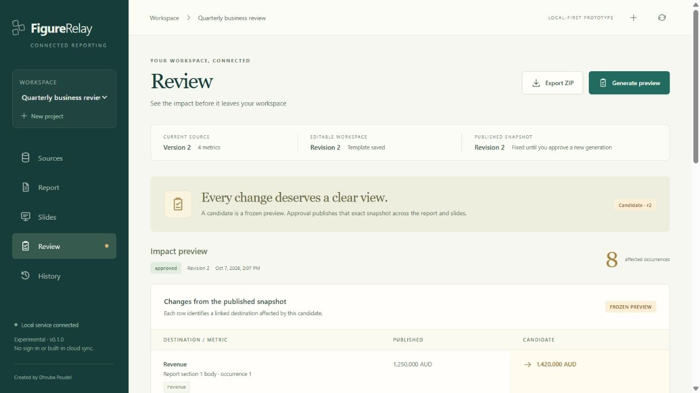

# FigureRelay

[](https://github.com/dhrubasuz/FigureRelay/actions/workflows/ci.yml)

**Keep the same figure consistent across your report and slides.**

FigureRelay is a local prototype for importing a set of named metrics, linking those metrics into report and slide templates, reviewing every occurrence, and approving a frozen publication bundle. Change a source value once, then review its effect everywhere it appears.

Created and maintained by **Dhruba Poudel** ([dhrubasuz](https://github.com/dhrubasuz)). Licensed under [Apache-2.0](LICENSE). Project repository: [dhrubasuz/FigureRelay](https://github.com/dhrubasuz/FigureRelay).

## What version 0.1 does

- Imports a UTF-8 CSV or an Excel `.xlsx` workbook containing a `Metrics` sheet.
- Identifies figures by stable keys such as `revenue.total`, rather than by a changing cell position.
- Links `{{key}}` placeholders in the built-in report and slide templates to those figures.
- Previews linked occurrences and freezes the generated files as a candidate revision.
- Approves the exact candidate revision that was reviewed.
- Downloads an approved ZIP containing `report.docx`, `slides.pptx`, and `manifest.json`.
- Records import, generation, approval, and export events in a local SQLite database.

The exported Office files set Author/Creator and Last Modified By metadata to **Dhruba Poudel**.



## Run locally

Requirements: Python **3.11 or later**, Node.js **24**, and pnpm **11.19.0**. Run the commands from this repository's root directory. The first installation needs internet access to retrieve dependencies. If pnpm is not installed, install the declared version with `npm install --global pnpm@11.19.0`.

On Windows, using PowerShell:

```powershell
python -m venv .venv
.\.venv\Scripts\python.exe -m pip install -r backend/requirements-dev.txt
.\.venv\Scripts\python.exe -m pip install -e backend
pnpm --dir frontend install --frozen-lockfile
pnpm --dir frontend build
.\.venv\Scripts\python.exe -m figurerelay
```

On macOS or Linux:

```sh
python3 -m venv .venv
.venv/bin/python -m pip install -r backend/requirements-dev.txt
.venv/bin/python -m pip install -e backend
pnpm --dir frontend install --frozen-lockfile
pnpm --dir frontend build
.venv/bin/python -m figurerelay
```

Open [http://127.0.0.1:8080](http://127.0.0.1:8080). The server listens on the loopback address. Stop it with Ctrl+C in its terminal. Rebuilding the frontend updates the interface served by the backend.

For frontend development, start the backend and run `pnpm --dir frontend dev` in a second terminal. See [development](docs/development.md) for checks and workflow details.

A [Dockerfile](Dockerfile) and [Compose configuration](compose.yaml) are also supplied. The container build and run path has not yet been verified on a Docker host.

## Try the workflow

1. In **Sources**, choose **Load demo**, or use **Import CSV or XLSX** with [the sample CSV](docs/sample-metrics.csv).
2. Open **Report** and **Slides**. Edit the built-in templates to include a metric key, for example `Revenue: {{revenue}}`, then choose **Save template**.
3. Choose **Generate preview** and inspect **Review**, including every linked occurrence and any unresolved key. Unsaved edits can be saved with **Save & preview**.
4. Choose **Approve & publish** only for the exact revision you have reviewed. This records a local approval; it does not post files to an external service.
5. Choose **Export ZIP**. It contains the frozen files from that candidate, together with the provenance manifest.
6. Choose **Stage sample v2**, or import changed source values, and generate a new candidate. The previously approved bundle remains a snapshot of its own revision and can be found in **History**.

The [quick start](docs/quickstart.md) explains the schema and review process. [Architecture](docs/architecture.md) explains the revision boundary.

## Input format

Provide these six columns, with one metric per row:

| Column | Meaning |
| --- | --- |
| `key` | Unique, stable identifier. Starts with a letter; remaining characters may be letters, digits, `_`, `.`, `:`, or `-`. |
| `label` | Required human-readable description. |
| `value` | A finite decimal for `number`, text for `text`, or `YYYY-MM-DD` for `date`. |
| `kind` | `number`, `text`, or `date`. |
| `unit` | Unit or currency information. `percent` displays a fraction such as `0.245` as `24.5%`; `%` displays `24.5` as `24.5%`. Other units are appended. |
| `period` | Reporting period, when relevant. |

For Excel, name the worksheet `Metrics`. Excel formula values require a stored cached result. FigureRelay does **not** evaluate formulas and cannot establish whether a workbook's cached results are current. Formula inputs therefore produce a warning; missing cached results block the import.

## Current boundaries

Version 0.1 is a single-user, local prototype. It does not provide authenticated organisational accounts, independent approval identities, tamper-proof audit records, a financial calculation engine, regulatory filing, live external connectors, or arbitrary existing Word/PowerPoint layout preservation. Report and slide exports are generated from FigureRelay's built-in template model. Names entered as actors are descriptive labels, not verified identities.

Edited prose is visible in the generated candidate. The occurrence change list compares linked metric values; it does not highlight prose additions, deletions, or rewrites against an earlier template. Review the full report and slide previews before approving. The browser preview does not certify Word pagination or PowerPoint layout.

Imports are limited to 5 MB per uploaded file and 5,000 metrics. Excel archives are also constrained to 25 MB expanded data and 2,000 ZIP entries. See [security](SECURITY.md) before choosing deployment or data-sharing settings.

## Project health

The repository contains backend and frontend tests and a CI workflow for tests, frontend type checks, and frontend builds. A workflow file is not evidence of a successful run: consult the actual run results for the revision you use. See [the changelog](CHANGELOG.md) for release status.

Useful contributions include reproducible bugs, better import error messages, accessibility improvements, and source/revision correctness checks. See [CONTRIBUTING.md](CONTRIBUTING.md), [governance](GOVERNANCE.md), and [the code of conduct](CODE_OF_CONDUCT.md).

If FigureRelay helps your reporting workflow, a GitHub star helps others discover it. Usage feedback and reproducible examples help us improve it.

## Licence and data ownership

The project's original code, documentation, and sample templates use Apache-2.0. Third-party components retain their own terms; see [third-party notices](THIRD_PARTY_NOTICES.md). The project does not claim ownership of your imported data or generated reports. Content you import can have its own rights and restrictions.

FigureRelay is an independent project. No commercial reporting vendor sponsors or endorses it.
